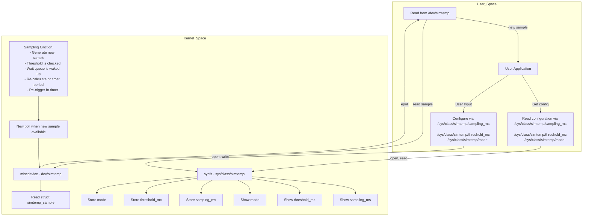

**Block diagram** of how the different modules (kernel and userspace) interact:

**How the modules interact:**

- nxp_simtemp is initialized (hrtimer, wait queue, miscdevice register, sysfs files created)
- hr timer callback is called periodically and a new sample is generated. wait queue is waked up.
- epoll is ready
- user space application catches the epoll update ready
- user space app reads the new sample
- user spapce app writes new configuration
- kernel device reads the new configuration and updates the related variables.
- hr timer callback is called again, a new sample is generated, threshold is checked with the new configuration, wait queue is waked up and the hr timer period is updated with the new configuration.
- epoll is ready
- user space application catches the epoll update ready
- user space app reads the new sample
- Cycle repeats until exit function is called. hrtimer is cancelled, miscdevice is deregistered and sysfs files removed.

**Locking choices:** Where do you use spinlocks vs mutexes and why? Point to code paths.

I used mutex in show and store functions, shared between kernel and user space. Because user space can call read and write functions concurrently. Check the following functions where mutex was used:

**simtemp_sampling_show** [`nxp_simtemp.c` lines 182-184](https://github.com/David-Paredes/simtemp/blob/main/kernel/nxp_simtemp.c#L182-L184)

**simtemp_sampling_store** [`nxp_simtemp.c` lines 197-199](https://github.com/David-Paredes/simtemp/blob/main/kernel/nxp_simtemp.c#L197-L199)

**simtemp_threshold_show** [`nxp_simtemp.c` lines 208-210](https://github.com/David-Paredes/simtemp/blob/main/kernel/nxp_simtemp.c#L208-L210)

**simtemp_threshold_store** [`nxp_simtemp.c` lines 223-225](https://github.com/David-Paredes/simtemp/blob/main/kernel/nxp_simtemp.c#L223-L225)

**simtemp_mode_show** [`nxp_simtemp.c` lines 234-236](https://github.com/David-Paredes/simtemp/blob/main/kernel/nxp_simtemp.c#L234-L236)

**simtemp_mode_store** [`nxp_simtemp.c` lines 249-251](https://github.com/David-Paredes/simtemp/blob/main/kernel/nxp_simtemp.c#L249-L251)

Since the sample struct is only read and not written from user space with simtemp_sample_read a mutex was not needed there, but the sample struct was modified in an interrupt by the hrtimer callback function, so a spinlock was added in these functions. Check the following functions where spinlocks were used:

**simtemp_sample_read** [`nxp_simtemp.c` lines 140-146](https://github.com/David-Paredes/simtemp/blob/main/kernel/nxp_simtemp.c#L140-L146)

**sample_hrtimer_callback** [`nxp_simtemp.c` lines 73-92](https://github.com/David-Paredes/simtemp/blob/main/kernel/nxp_simtemp.c#L73-L92)

**API trade‑offs:** Why use `ioctl` vs `sysfs` for control/eventing here.

I chose sysfs bacause is easier to configure and use. Since the data and controls in this device are simple, sysfs is suitable. If the actions and structs were more complex i would have used ioctl.

**Device Tree mapping:** How does `compatible` and properties map to `probe()`? Defaults if DT is missing.

**Scaling:** What breaks first at **10 kHz** sampling? Strategies to mitigate.

The user space would break first. In theory the hr timer can still function at 10kHz, so samples would still be sent. The problem is sysfs, it would not work propperly and user space would not be able to receive the infomation. 
To mitigate it a buffer can be used. Kernel space would sample at a 100us period and user space would read for example a buffer of 100 at a 10ms period.
